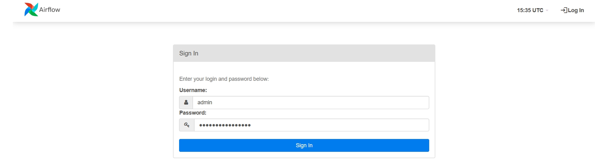
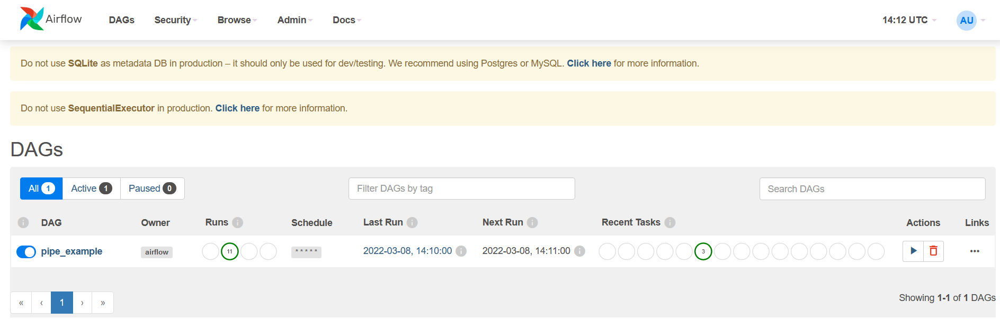

This repo includes the docker container environment to try and experience the Airflow elementary steps

**To deploy**

1. git clone https://github.com/muzafferkahraman/airflow_sandbox.git
2. cd airflow_sandbox
3. make all
4. check if all the containers are up and running
>       docker ps
5. get the password for the airflow admin
>      docker exec -ti airflow_sandbox_airflow_1 cat /opt/airflow/standalone_admin_password.txt
6. Type <ip of the host>:8080 at  the browser's address bar, username=admin & password=(you got that at step 5)

7.        

 
	
8.        

	

Notes: The test environment is composed of 3 containers: Centos, Airflow and Mysql
* 	Centos container runs a very simple api server that provides a csv format of a random name,surname and age, that's changed every minute
* 	Airflow container runs the dag (pipe_demo_dag.py)  that extracts the input by sending http GETs to the centos, transorms it (uppercase) then loads it to the Mysql container
*   Mysql  container stores the db table whose entries are set by the Airflow container
	
	

